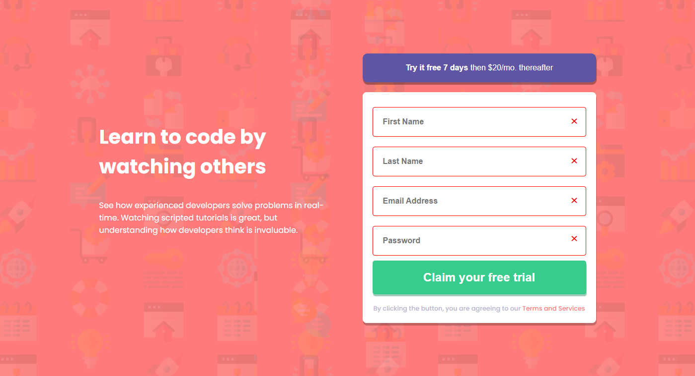

# Desafio do Frontend Mentor - sign up

Neste projeto, meu desafio era criar uma landing page de login reponsiva usando HTML, CSS e Javascript.

## Veja como ficou a versão desktop do projeto.

## ACESSE O SITE

[CASO PREFERIR, ACESSE O SITE.](https://oswaldomauricio.github.io/Login-Form/)

## Frontend Mentor

Caso queira fazer o mesmo desafio, acesse o site do Frontend Mentor [clicando aqui](https://www.frontendmentor.io).

## Minhas redes sociais

 
  
  
  
   

